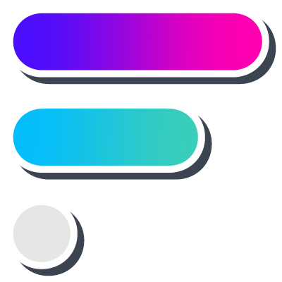

<!-- PROJECT HEADER -->

<div align="center">
  <a href="https://formsify.vercel.app/">
    
    <h1>Formsify | Let's Create Better Forms 📋</h1>
  </a>
  
  <p align="center">
    <a href="https://formsify.vercel.app/">View Project</a>
    |
    <a href="https://github.com/githubotoro/formsify-web3-app/issues">Report Bug</a>
    |
    <a href="https://github.com/githubotoro/formsify-web3-app/issues">Request Feature</a>
    <br/>
    <a href="https://twitter.com/formsifying">Twitter</a>
    |
    <a href="https://github.com/githubotoro/formsify-smart-contract">Smart Contract</a>
    <br/>
    <b>If you like this project, don't forget to give it a star! <br/> Thanks! 😊</b>
  </p>
</div>

## **Formsify In A Tweet ✒️**

> Your forms are **Good**, but they can be **Better** 💯

👉 **[Formsify](https://formsify.vercel.app/)** helps you in creating better forms, which are **Decentralized**, **Trustless** & **Distributed**.

<!-- PROJECT LINKS -->

## **Project Links 🔗**

> 📌 **[Website](https://formsify.vercel.app/) (formsify.vercel.app)**

> 🌐 **[Twitter](https://twitter.com/formsifying) (@formsifying)**

> 💻 **GitHub Source Code: [Web3 App](https://github.com/githubotoro/formsify-web3-app) | [Smart Contract](https://github.com/githubotoro/formsify-smart-contract)**

<!-- PROJECT LINKS -->

<!-- PROJECT HEADER -->

<!-- PROJECT EVOLUTION -->

## **Project Evolution 🚀**

> 👉 All the below links show the **evolution** of project - **from** building idea **to** shipping features and **finally** featured working state.

-   **[04.07.2022](https://www.loom.com/share/0b1e3036c74648a2b892e96025327d3d)**
-   **[12.07.2022](https://www.loom.com/share/2530bdb7728e4e4f92b731d90eccf944)**
-   **[19.07.2022](https://www.loom.com/share/a59261f9053f4a31a0d96912d78fee29)**
-   **[26.07.2022](https://www.loom.com/share/e513e241789546e0ab88ba26ba6d1ffb)**
-   **[02.08.2022](https://www.loom.com/share/cbd8f6e0130543918aae47ade23050fe)**
-   **[09.08.2022](https://www.loom.com/share/74a17e44b5644ec4899c30f39f7b1ffa)**
-   **[14.08.2022](https://www.loom.com/share/59ce65d2d0804c42926d5220f0b89ed3)**
-   **[19.08.2022](https://www.youtube.com/watch?v=-BZ2BwME1g0)**

<!-- PROJECT EVOLUTION -->

<!-- ABOUT THE PROJECT -->

## **Inspiration 📌**

👉 **Currently** available "Online Survey Services" are **Centralized**, **Trust-Based** & **Dependent**.

> _" Thus, we have challenges of **Integrity**, **Transparency** and **Accessibility**. "_

🔎 Let's have a **discussion** on the problems and drawbacks of **Online Survey Services**

### **1. Integrity 🤝**

#### **Definition 👋**

> The quality of being **honest** and having strong **moral** principles.

#### **Problems 💢**

> **How do you make sure 👇**

-   that the **server** which holds your information wouldn't be **compromised**?
-   that the **platform** which holds your forms, wouldn't go **down**?
-   that the **system** which holds your data, wouldn't **betray** you?

### **2. Transparency 📋**

#### **Definition 👋**

> Operating in such a way that it is easy for others to **see** what **actions** were **performed**.

#### **Problems 💢**

> **How do you confirm 👇**

-   that your **data** was **unaltered**?
-   that your **forms** were **fair** to all respondents?
-   that no-one **filled** forms on **behalf** of others?

### **3. Accessibility ✅**

#### **Definition 👋**

> The **information** that the user needs must be **perceivable** to them.

#### **Problems 💢**

> **How do you ensure 👇**

-   that your **data** will be accessible, even when system goes **down**?
-   that your **forms** can be **independently** interacted with at all the times?
-   that **access** to your information cannot be **revoked**?

## **What Formsify Does 💯**

👉 Formsify helps in creating **Decentralized**, **Trustless** & **Distributed** forms by giving each form their **own** digital identity in terms of **smart contract** and storing them **on-chain**.

> _" Thus, we address the challenges of **Integrity**, **Transparency** and **Accessibility**. "_

🔎 Let's have a **discussion** on how Formsify **solves** the problems and drawbacks of **Online Survey Services**

### **1. Integrity 🤝**

#### **Solution ✔️**

> **We make sure 👇**

-   that your data is **decentralized** and therefore, it remains uncompromised because there isn't any single point of failure.
-   that your forms are platform **independent** and the interface can be re-built by anyone if we go down.
-   that the system **isn't controlled** by any single entity, therefore betrayal isn't possible until majority of the network gets compromised.

### **2. Transparency 📋**

#### **Solution ✔️**

> **We confirm 👇**

-   that data is **immutable** by storing it on Blockchain.
-   that your forms are **unbiased** in all scenarios by ensuring that they cannot be altered.
-   that **no-one** can fill forms on behalf of others, until and unless respondent's wallet is compromised.

### **3. Accessibility ✅**

#### **Solution ✔️**

> **We ensure 👇**

-   that your **data** is **accessible**, even if go down by storing it on-chain.
-   that your **forms** can be **independently** interacted with by representing them as separate smart contracts.
-   that **access** to your information cannot be **revoked** because no single entity can stop you from accessing it.

## **Improvements in Web3 Ecosystem 🌐**

### **1. Accountability ❗️**

> Respondent **cannot deny**, once their **transaction** is recorded on-chain which makes them accountable to their responses.

### **2. Spam Infeasibility ⚠️**

> Since each **form submit** will be backed by some amount of **gas**, it makes the intention of spam entries infeasible in a long run.

### **3. Independency ☑️**

> Forms are **unbiased** and have their **own digital identity** which cannot be tampered with.

<!-- ABOUT THE PROJECT -->

<!-- BUILT WITH -->

## **Built With 🔍**

**[React.js](https://reactjs.org/), [DaisyUI](https://daisyui.com/), [Firebase](https://firebase.google.com/), [RainbowKit](https://www.rainbowkit.com/), [Wagmi](https://wagmi.sh/), [Vercel](https://vercel.com/), [Tailwind CSS](https://tailwindcss.com/), [Ethers.js](https://docs.ethers.io/v5/), [Alchemy](https://www.alchemy.com/), [Fluent Emoji](https://github.com/microsoft/fluentui-emoji), [React Toastify](https://www.npmjs.com/package/react-toastify)**

<!-- BUILT WITH -->

<!-- HOW FORMSIFY WAS BUILT -->

## **How Formsify Was Built 🧱**

> Each **form** is represented as an indiviudal **smart contract**
> The Smart Contract has following main features:

-   **Owner** (Form Deployer)
-   **Fills** (Total fills of the deployed form)
-   **maxFills** (Maximum fills that are allowed per form)
-   **startTime** and **endTime** (Opening and closing times of form)
-   **allowedTotalFills** (Number of fills allowed per user for a particular form)
-   **formHead** (Headers of the form which includes the initial parameters of heading and description)
-   **fields** (Question fields of the form)
-   **records** (Stores responses of the deployed form)
-   **filledRecords** (Tracks fill id and total number of fills of a particular address)

> We had to make sure that each form **response**, although stored on-chain, would still remain unreadable to **ensure** data privacy.

-   We achieved it using **AES Cryptography**, where key of each form would be unique, generated using **[react-uuid](https://www.npmjs.com/package/react-uuid)** and encryption-decryption is carried out using **[crypto-js](https://www.npmjs.com/package/crypto-js)**.

> App is based on following:

-   made using **[React](https://reactjs.org/)**
-   styled using **[Tailwind](https://tailwindcss.com/)**
-   designed using **[DaisyUI](https://daisyui.com/)**
-   data is stored on **[Firebase](https://firebase.google.com/)**
-   chain on which forms are stored is **[Polygon](https://polygon.technology/)**
-   connect wallet funtionality is abstracted from **[RainbowKit](https://www.rainbowkit.com/)**
-   chain APIs are fetched from **[Alchemy](https://www.alchemy.com/)**
-   web3 app is deployed on **[Vercel](https://vercel.com/)**

<!-- HOW FORMSIFY WAS BUILT -->

<!-- CHALLENGES -->

## **Challenges Tackled Down 😎**

-   deploying **smart contracts** from **frontend**
-   **synchronizing** block time and local time of forms deployed **on-chain**
-   **maintaining** data **privacy** while storing data on-chain
-   **cryptographic** encryption and decryption of fetched form **data** locally
-   setting form **parameters** of smart contracts to ensure **fill frequency and limits**

<!-- CHALLENGES -->

<!-- GETTING STARTED -->

## **Getting Started 🚀**

> All you need to get started with this project is **Formsiness** 👀

### **Installation 💻**

1.  **Clone** this repo.
    ```sh
    git clone https://github.com/githubotoro/formsify-web3-app.git
    ```
2.  **(Optional)** Modify **Formsify.json** under **/src/helper/Formsify.json** to customize the smart contract according to your requirements.

    > **NOTE: If you want to make changes to smart contract, refer this **[formsify-smart-contract](https://github.com/githubotoro/formsify-smart-contract)** project and don't forget to update Formsify.json in your web3 app after compilation.**

3.  Get your own **Alchemy API Key** on **"Polygon Mumbai Testnet"** from **[Alchemy](https://www.alchemy.com/).** Make a **.env** file in the root directory and enter the following line.

    ```sh
    REACT_APP_POLYGON_MUMBAI_API_KEY = "YOUR_ALCHEMY_API_KEY"
    ```

    > **NOTE: Never push your .env file to GitHub.**

4.  **Install** NPM packages.
    ```sh
    npm install
    ```
5.  **Start** the project.

    ```sh
    npm start
    ```

6.  **Time to create Formsify Forms! ✅**

<!-- GETTING STARTED -->

<!-- CONTRIBUTING -->

## **Contributing 🤝**

"Formsify" is an open-sourced project and any contributions you make are greatly appreciated. If you have a suggestion that would make this better, please fork the repo and create a pull request. You can also simply open an issue with the tag "Formsifying". 🏷

1. Fork the Project
2. Create your Feature Branch (`git checkout -b feature/FormsifyFeature`)
3. Commit your Changes (`git commit -m 'Add some FormsifyFeature'`)
4. Push to the Branch (`git push origin feature/FormsifyFeature`)
5. Open a Pull Request

<!-- CONTRIBUTING -->

<!-- LICENSE -->

## **License 📃**

Distributed under the **MIT License**. See `LICENSE` for more information.

<!-- LICENSE -->

<!-- CONTACT -->

## **Contact 👋**

> **Uday Khokhariya**

-   **Twitter** - [yupuday](https://twitter.com/yupuday)
-   **Email** - uday.khokhariya@gmail.com

<!-- CONTACT -->

<!-- ACCOMPLISHMENTS -->

## **Accomplishments 😇**


👉 Formsify has been a part of 🦄 **Buildspace's Nights and Weekends Program - Season 1** and was also **presented** under their "Demo Day" held on **6.8.2022**

<!-- ACCOMPLISHMENTS -->

<!-- WHAT WE LEARNED -->

## **What We Learned 🎓**

> Added the following learnings to our portfolio:

-   Pre-planning of solution before coding does matter. (We learnt it the hard-way. 😅)
-   Making separate components helps in saving a lot of development time. (Reusability is highly underrated! ⌛️)
-   Take proper backups before forcing a git repo to commit back to previous release. (Just in case you mess up like us, there is a command called 'git reflog', use it wisely. May the force be with you! 🌌)
-   Things which work locally, can create serious problems after deployement, if left untested. (What happens on localhost, stays on localhost. 😬)
-   Conduct experiments on a trial project before breaking up the main code. (Breaking & fixing is the endgame after all. 😌)

<!-- WHAT WE LEARNED -->

<!-- NEXT FOR FORMSIFY -->

## **What's Next For Formsify 👀**

> We are looking forward on the inclusion of following features:

-   make **dynamic** smart contract creation based on forms
-   include more **customization** options
-   have forms record information as **solitary** variables instead of a JSON string
-   provide **saving & editing** functionalities for form respondents
-   add editable smart contract functions for **after** deployment changes

<!-- NEXT FOR FORMSIFY -->
