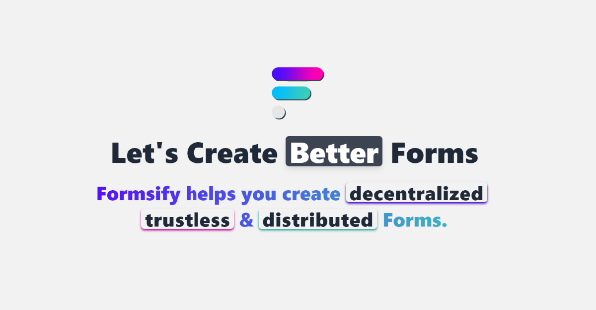

<!-- PROJECT HEADER -->

<br />
<div align="center">
  <a href="https://formsify.vercel.app/">
    
    <h1><b>Formsify</b><br/><b>Let's Create Better Forms</b></h1>
  </a>
  
  <p align="center">
    <a href="https://formsify.vercel.app/">View Project</a>
    |
    <a href="https://github.com/githubotoro/formsify-web3-app/issues">Report Bug</a>
    |
    <a href="https://github.com/githubotoro/formsify-web3-app/issues">Request Feature</a>
    <br/>
    <a href="https://twitter.com/formsifying">Twitter</a>
    |
    <a href="https://github.com/githubotoro/formsify-smart-contract">Smart Contract</a>
    <br/> <br/>
    <b>If you like this project, don't forget to give it a star! <br/> Thanks! 😊</b>
  </p>
  
</div>

<!-- PROJECT HEADER -->

<!-- TABLE OF CONTENTS -->

## Table of Contents 📌

  <ol>
    <li>
      <a href="#about-the-project">About The Project</a>
      <ul>
        <li><a href="#built-with">Built With</a></li>
      </ul>
      <!-- <ul>
        <li><a href="#colour-palette">Colour Palette</a></li>
      </ul> -->
      <!-- <ul>
        <li><a href="#font-used">Font Used</a></li>
      </ul> -->
    </li>
    <li>
      <a href="#getting-started">Getting Started</a>
      <ul>
        <li><a href="#installation">Installation</a></li>
      </ul>
    </li>
    <li><a href="#contributing">Contributing</a></li>
    <li><a href="#license">License</a></li>
    <li><a href="#contact">Contact</a></li>
    <li><a href="#project-links">Project Links</a></li>
    <li><a href="#acknowledgements">Acknowledgments</a></li>
  </ol>

<!-- TABLE OF CONTENTS -->

<!-- ABOUT THE PROJECT -->

<a name="about-the-project"></a>

## About The Project 📝

<div align="center">
<a href="https://formsify.vercel.app/">
    
</a>
</div>

Formsify helps in creating better forms, which are decentralized, trustless and distributed. 📋

<!-- ABOUT THE PROJECT -->

<!-- BUILT WITH -->

<a name="built-with"></a>

### Built With 🔍

-   [Polygon](https://polygon.technology/)
-   [React.js](https://reactjs.org/)
-   [DaisyUI](https://daisyui.com/)
-   [Firebase](https://firebase.google.com/)
-   [RainbowKit](https://www.rainbowkit.com/)
-   [Wagmi](https://wagmi.sh/)
-   [Vercel](https://vercel.com/)
-   [Tailwind](https://tailwindcss.com/)
-   [Ethers.js](https://docs.ethers.io/v5/)
-   [Alchemy](https://www.alchemy.com/)
-   [React Toastify](https://www.npmjs.com/package/react-toastify)

<!-- BUILT WITH -->

<!-- GETTING STARTED -->

<a name="getting-started"></a>

## Getting Started 🚀

All you need to get started with this project is **Formsiness** 👀

<a name="installation"></a>

### Installation 💻

1.  **Clone** this repo.
    ```sh
    git clone https://github.com/githubotoro/formsify-web3-app.git
    ```
2.  **(Optional)** Modify **Formsify.json** under **/src/helper/Formsify.json** to customize the smart contract according to your requirements.

    > **NOTE: If you want to make changes to smart contract, refer this **[formsify-smart-contract](https://github.com/githubotoro/formsify-smart-contract)** project and don't forget to update Formsify.json in your web3 app after compilation.**

3.  Get your own **Alchemy API Key** on **"Polygon Mumbai Testnet"** from **[Alchemy](https://www.alchemy.com/).** Make a **.env** file in the root directory and enter the following line.

    ```sh
    REACT_APP_POLYGON_MUMBAI_API_KEY = "YOUR_ALCHEMY_API_KEY"
    ```

    > **NOTE: Never push your .env file to GitHub.**

4.  **Install** NPM packages.
    ```sh
    npm install
    ```
5.  **Start** the project.

    ```sh
    npm start
    ```

6.  **Time to create Formsify Forms! ✅**

<!-- GETTING STARTED -->

<!-- CONTRIBUTING -->

<a name="contributing"></a>

## Contributing 🤝

"Formsify" is a open-sourced project and any contributions you make are greatly appreciated. If you have a suggestion that would make this better, please fork the repo and create a pull request. You can also simply open an issue with the tag "Formsifying". 🏷

1. Fork the Project
2. Create your Feature Branch (`git checkout -b feature/FormsifyFeature`)
3. Commit your Changes (`git commit -m 'Add some FormsifyFeature'`)
4. Push to the Branch (`git push origin feature/FormsifyFeature`)
5. Open a Pull Request

<!-- CONTRIBUTING -->

<!-- LICENSE -->

<a name="license"></a>

## License 📃

Distributed under the **MIT License**. See `LICENSE` for more information.

<!-- LICENSE -->

<!-- CONTACT -->

<a name="contact"></a>

## Contact ☎️

> **Uday Khokhariya**

-   **Twitter** - [yupuday](https://twitter.com/yupuday)
-   **Email** - uday.khokhariya@gmail.com

<!-- CONTACT -->

<!-- PROJECT LINKS -->

<a name="project-links"></a>

## Project Links 🔗

> **Deployed Live Project Link** : [https://formsify.vercel.app](https://formsify.vercel.app)

> **GitHub Web3 App Project Link** : [https://github.com/githubotoro/formsify-web3-app](https://github.com/githubotoro/formsify-web3-app)

> **GitHub Smart Contract Project Link** : [https://github.com/githubotoro/formsify-smart-contract](https://github.com/githubotoro/formsify-smart-contract)

<!-- PROJECT LINKS -->

<!-- ACKNOWLEDGMENTS -->

<a name="acknowledgements"></a>

## Acknowledgments 🙌

-   [Choose an Open Source License](https://choosealicense.com)
-   [Get Emoji](https://getemoji.com/)

<!-- ACKNOWLEDGMENTS -->

<div align="center">
  <a href="https://formsify.vercel.app">
    
    <h1><b>Let's create better forms, together! 💯</b></h1>
  </a>
</div>
